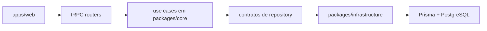

# EduPlatformJS

EduPlatformJS e um monorepo focado em plataforma educacional com arquitetura em camadas, regras de dominio isoladas do framework e operação centrada em `Next.js`, `tRPC`, `Prisma` e `PostgreSQL`.

O repositório foi estruturado para manter separação clara entre:

- dominio e casos de uso em `packages/core`
- implementações concretas em `packages/infrastructure`
- experiência web em `apps/web`
- experimento mobile isolado em `apps/native`

## Visao geral

O objetivo do projeto ? entregar uma base profissional para:

- catalogo educacional por `series -> subjects -> topics -> contents`
- modulos publicos e administrativos para `accessibility` e `vestibular`
- autenticação com papéis `USER` e `ADMIN`
- checklist por usuario autenticado
- governanca administrativa com auditoria de troca de papel

## Arquitetura



Principios centrais:

- `core` não depende de `infrastructure`
- `use cases` não conhecem Prisma, Next.js, sessao ou contexto HTTP
- `routers` ficam finos: validação + orquestração
- `repositories` retornam dominio, não objetos Prisma crus
- o frontend não acessa repositories diretamente

## Estrutura do monorepo

```text
.
|- apps/
|  |- web/                     Aplicação principal em Next.js App Router
|  `- native/                  Shell experimental em Expo
|- docs/                       Documentação operacional e material auxiliar
|- packages/
|  |- core/                    Entidades, DTOs, contratos, erros e use cases
|  |- infrastructure/          Prisma, mappers, container e repositories
|  `- typescript-config/       Configs compartilhadas de TypeScript
`- prisma/                     Schema, migrations e guias de operação
```

## Workspaces

### `apps/web`

Aplicação principal do produto. Reune:

- paginas públicas
- painel administrativo
- autenticação
- contexto tRPC
- integração com os casos de uso

Documentação: [apps/web/README.md](./apps/web/README.md)

### `apps/native`

Shell experimental em Expo/React Native. Não acompanha a maturidade do `web` e deve ser tratado como trilha pausada até nova priorização.

Documentação: [apps/native/README.md](./apps/native/README.md)

### `packages/core`

Camada de dominio do projeto. Contem:

- entidades
- DTOs
- contratos de repository
- `AppError`
- use cases por modulo

Documentação: [packages/core/README.md](./packages/core/README.md)

### `packages/infrastructure`

Camada de implementação concreta. Contem:

- client Prisma
- mappers
- repositories
- container de composicao
- validação de ambiente de banco

Documentação: [packages/infrastructure/README.md](./packages/infrastructure/README.md)

### `packages/typescript-config`

Configs compartilhadas para padronização de TypeScript entre workspaces.

Documentação: [packages/typescript-config/README.md](./packages/typescript-config/README.md)

## Modulos funcionais

O estado atual validado do produto inclui:

- `series`
- `subjects`
- `topics`
- `contents`
- `checklist`
- `accessibility`
- `vestibular`
- `auth`
- `admin users` com gestão de papel
- `user role audit log`

## Segurança e governanca

O monorepo já incorpora uma base importante de hardening:

- RBAC com `USER` e `ADMIN`
- `adminProcedure` para mutacoes administrativas
- validação server-side do layout `/admin`
- ownership no checklist
- `AppError` com traducao consistente para tRPC
- validação tipada de ambiente
- auditoria persistida para troca de papel
- headers basicos de segurança no `web`
- CI, lint moderno e scripts de validação consistentes

## Comeco rapido

### 1. Instalar dependencias

```bash
npm install
```

### 2. Configurar ambiente

As variáveis mínimas esperadas hoje sao:

| Variável | Obrigatoria | Finalidade |
| --- | --- | --- |
| `DATABASE_URL` | sim* | conexão principal com PostgreSQL |
| `DIRECT_URL` | sim* | conexão direta alternativa para Prisma |
| `AUTH_SECRET` | sim | segredo do Auth.js, mínimo de 32 caracteres |
| `GOOGLE_CLIENT_ID` | sim | OAuth do Google |
| `GOOGLE_CLIENT_SECRET` | sim | OAuth do Google |
| `ADMIN_EMAILS` | não | bootstrap e recuperação inicial de administradores |

\* ? necessário ter `DATABASE_URL` ou `DIRECT_URL`.

### 3. Gerar o client Prisma

```bash
npm run prisma:generate
```

### 4. Rodar a aplicação web

```bash
npm run dev --workspace web
```

## Scripts principais

| Comando | Finalidade |
| --- | --- |
| `npm run dev` | executa `turbo run dev` para workspaces com script `dev` |
| `npm run dev --workspace web` | sobe apenas a aplicação principal |
| `npm run build` | build do monorepo via Turbo |
| `npm run build --workspace web` | build do app principal |
| `npm run lint` | lint oficial do projeto, hoje centralizado no `web` |
| `npm run typecheck` | typecheck de `core`, `infrastructure` e `web` |
| `npm test` | testes de arquitetura, `core`, `infrastructure` e routers do `web` |
| `npm run db:seed` | recria a base provisória de catálogo, vida prática, acessibilidade e vestibulares |
| `npm run test:architecture` | guardrails de dependencia entre camadas |
| `npm run test:web` | testes dos routers tRPC do app web |
| `npm run audit:prod` | `npm audit --omit=dev` |
| `npm run audit:full` | `npm audit` completo |
| `npm run format` | formatação com Prettier |

## Validação recomendada antes de merge ou deploy

```bash
npm test
npm run prisma:generate
npx tsc -p packages/core/tsconfig.json --noEmit
npx tsc -p packages/infrastructure/tsconfig.json --noEmit
npx tsc -p apps/web/tsconfig.json --noEmit
npm run lint --workspace web
npm run build --workspace web
```

Se houver alteração de dependencias:

```bash
npm audit
npm audit --omit=dev
```

## Banco e migrations

Leia [prisma/README.md](./prisma/README.md) antes de aplicar migrations em ambiente com dados historicos.

Pontos importantes:

- o repositório já possui baseline de migrations
- a estrategia para banco novo e diferente da estrategia para banco já populado
- `npm run db:seed` preserva usuários e autenticação, mas recria as tabelas de catálogo educacional e conteúdos públicos
- drift e duplicidade devem ser avaliados antes de aplicar constraints em base historica
- não existe recomendação de SQL destrutivo automatico no repositório

## Documentação adicional

- [docs/README.md](./docs/README.md)
- [docs/dependency-audit.md](./docs/dependency-audit.md)
- [docs/github-root-readme.md](./docs/github-root-readme.md)
- [docs/vercel-migration.md](./docs/vercel-migration.md)
- [prisma/README.md](./prisma/README.md)
- [apps/web/README.md](./apps/web/README.md)
- [apps/native/README.md](./apps/native/README.md)
- [packages/core/README.md](./packages/core/README.md)
- [packages/infrastructure/README.md](./packages/infrastructure/README.md)

## Estado atual e limitacoes honestas

- `apps/web` e a experiência principal e mais madura do produto
- `apps/native` continua experimental e pausado
- `npm audit --omit=dev` esta limpo para producao
- `npm audit` completo esta limpo com overrides auditados para dependencias transitivas sem patch direto seguro
- a suite automatizada cobre arquitetura, dominio, mappers de infraestrutura e routers tRPC criticos do `web`
- a validação final de drift e duplicidades em banco já populado depende do estado real do banco fora do repositório

## Quando editar cada camada

| Caso | Camada principal |
| --- | --- |
| Nova regra de negocio | `packages/core` |
| Nova persistencia ou mapper | `packages/infrastructure` |
| Nova rota ou validação de entrada | `apps/web/src/server` |
| Nova tela, fluxo ou UX | `apps/web/app` |
| Mudanca de schema e persistencia | `prisma/` + `packages/infrastructure` |
| Documentação operacional | `README.md`, `docs/`, `prisma/README.md` |

## Status de maturidade

O projeto já esta em um nivel avancado de estrutura tecnica. A prioridade atual não e reconstruir base, e sim manter consistencia, documentação honesta e refinamentos finais de produto e operação.
