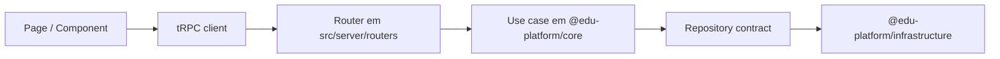

# EduPlatformJS Web

`apps/web` e a aplicação principal do EduPlatformJS. Ela concentra a experiência pública e administrativa do produto, alem da integração entre UI, autenticação, tRPC e os casos de uso compartilhados.

## Objetivos desta workspace

- entregar a interface principal do produto
- manter routers finos e previsiveis
- aplicar RBAC e validação server-side nas ?reas administrativas
- consumir contratos de `@edu-platform/core` sem acoplar regra de negocio ao frontend

## Stack principal

- `Next.js 16` com App Router
- `React 19`
- `tRPC 11`
- `Auth.js`
- `Zod`
- `React Query`
- `Tailwind CSS`

## Mapa de rotas

### Rotas públicas principais

- `/`
- `/login`
- `/contents`
- `/subjects`
- `/topics`
- `/vestibulares`
- `/vestibulares/[id]`

### Rotas autenticadas

- `/dashboard`
- `/checklist`

### Rotas administrativas

- `/admin`
- `/admin/series`
- `/admin/subjects`
- `/admin/topics`
- `/admin/contents`
- `/admin/accessibility`
- `/admin/vestibulares`
- `/admin/users`
- `/admin/users/audit`

## Fluxo tecnico



## Estrutura relevante

```text
apps/web
|- app/                       Rotas App Router
|  |- admin/                  Backoffice
|  |- checklist/              Fluxo do usuario autenticado
|  |- dashboard/              Painel principal
|  |- contents/               Navegação pública de conteúdos
|  `- vestibulares/           Modulo publico de vestibulares
|- src/
|  |- components/             Componentes compartilhados
|  |- lib/                    Auth, env e ?tilitarios de app
|  |- server/
|  |  |- routers/             Routers tRPC
|  |  |- context.ts           Composicao de sessao + repositories
|  |  `- trpc.ts              Procedures public/protected/admin
|  `- types/                  Augmentations e tipos auxiliares
`- next.config.ts             Config global do app
```

## Modulos do produto expostos no web

- `series`
- `subjects`
- `topics`
- `contents`
- `checklist`
- `accessibility`
- `vestibular`
- `users` para gestão administrativa de papéis
- `user role audit` para historico de governanca

## Segurança aplicada no app

- `protectedProcedure` para fluxos autenticados
- `adminProcedure` para mutacoes administrativas
- validação server-side de acesso em `/admin`
- traducao consistente de erros de dominio via `AppError`
- validação de payload com `Zod`
- headers basicos de segurança em todas as rotas via `next.config.ts`

Headers configurados hoje:

- `Referrer-Policy: strict-origin-when-cross-origin`
- `X-Content-Type-Options: nosniff`
- `X-Frame-Options: DENY`
- `Permissions-Policy: camera=(), microphone=(), geolocation=()`

## Ambiente

O app depende de:

| Variável | Descrição |
| --- | --- |
| `AUTH_SECRET` | segredo do Auth.js |
| `GOOGLE_CLIENT_ID` | OAuth Google |
| `GOOGLE_CLIENT_SECRET` | OAuth Google |
| `DATABASE_URL` ou `DIRECT_URL` | conexão de banco usada por Prisma e repositories |
| `ADMIN_EMAILS` | bootstrap/recuperação inicial de admins |

Validação:

- auth: [apps/web/src/lib/env.ts](./src/lib/env.ts)
- banco: [packages/infrastructure/src/config/env.ts](../../packages/infrastructure/src/config/env.ts)

## Scripts ?teis

```bash
npm run dev --workspace web
npm run test:web
npm run lint --workspace web
npm run build --workspace web
npx tsc -p apps/web/tsconfig.json --noEmit
```

## Regras de manutencao

- não mover regra de negocio para componentes ou pages sem necessidade
- routers devem ficar finos: validação + chamada de use case
- todo fluxo admin deve continuar atras de `adminProcedure`
- componentes de formulario devem manter validação coerente com os routers
- se um erro vem do dominio, preserve `AppError` em vez de recriar mensagens arbitrarias no frontend

## Quando editar cada pasta

| Pasta | Quando mexer |
| --- | --- |
| `app/` | novas paginas, layouts, UX, metadata e fluxos do App Router |
| `src/server/routers/` | endpoints tRPC e validação de entrada |
| `src/lib/` | auth, env, clientes e ?tilitarios |
| `src/components/` | UI compartilhada entre paginas |
| `src/types/` | augmentations de tipos do app |

## Estado atual

- a aplicação principal esta operacional
- `dashboard`, `checklist` e `vestibulares` publicos já receberam rodada de maturidade funcional
- `accessibility` admin e `vestibular` admin já receberam rodada inicial de refinamento visual e textual
- a governanca de usuários e auditoria administrativa já estao presentes no painel

## Validação recomendada para alteracoes no app

```bash
npm test
npm run test:web
npm run prisma:generate
npx tsc -p packages/core/tsconfig.json --noEmit
npx tsc -p packages/infrastructure/tsconfig.json --noEmit
npx tsc -p apps/web/tsconfig.json --noEmit
npm run lint --workspace web
npm run build --workspace web
```
