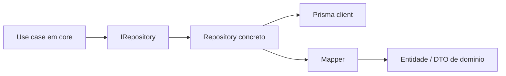

# @edu-platform/infrastructure

`@edu-platform/infrastructure` implementa a camada concreta do monorepo. Aqui vivem o client Prisma, os mappers e os repositories que cumprem os contratos definidos em `@edu-platform/core`.

## Responsabilidades

- configurar acesso ao banco
- validar ambiente de infraestrutura
- mapear modelos Prisma para entidades de dominio
- implementar repositories 1:1 com os contratos do `core`
- expor um container simples de composicao para o app web

## Estrutura

```text
packages/infrastructure/src
|- config/            Validação de ambiente de banco
|- generated/         Artefatos gerados de suporte
|- logger/            Utilitarios de logging, quando aplicavel
|- mappers/           Conversao entre Prisma e dominio
|- prisma/            Client e composicao de acesso
`- repositories/      Implementacoes concretas dos contratos
```

## Fluxo esperado



## Repositories disponiveis

- `SeriesRepository`
- `SubjectRepository`
- `TopicRepository`
- `ContentRepository`
- `ChecklistRepository`
- `VestibularRepository`
- `UserRepository`
- `AccessibilityRepository`

Ponto de composicao: [packages/infrastructure/src/container.ts](./src/container.ts)

## Regras de manutencao

- repository não deve devolver objeto Prisma cru
- transformacoes compartilhadas devem viver em mappers
- contratos do `core` devem ser implementados fielmente
- env de banco deve falhar cedo quando invalido
- detalhes de persistencia não devem vazar para a UI

## Ambiente

Validação atual:

- `DATABASE_URL` ou `DIRECT_URL`
- `NODE_ENV` com fallback coerente

Arquivo de referencia: [packages/infrastructure/src/config/env.ts](./src/config/env.ts)

## Prisma

Este pacote depende do schema e das migrations em [prisma/](../../prisma/README.md).

Antes de mexer em repositories:

1. confirme o contrato no `core`
2. revise o schema Prisma
3. atualize mapper e repository juntos
4. valide typecheck e testes

## Validação recomendada

```bash
npx prisma generate
npx tsc -p packages/infrastructure/tsconfig.json --noEmit
npm run test:infrastructure
```

## Quando editar esta camada

Edite `infrastructure` quando a mudanca envolver:

- query de banco
- implementação concreta de repository
- mapper entre banco e dominio
- composicao do container
- ajustes do client Prisma

## Principio final

Se o `core` diz o que o sistema precisa fazer, `infrastructure` e a camada que diz como isso acontece no banco e nos adaptadores concretos.
